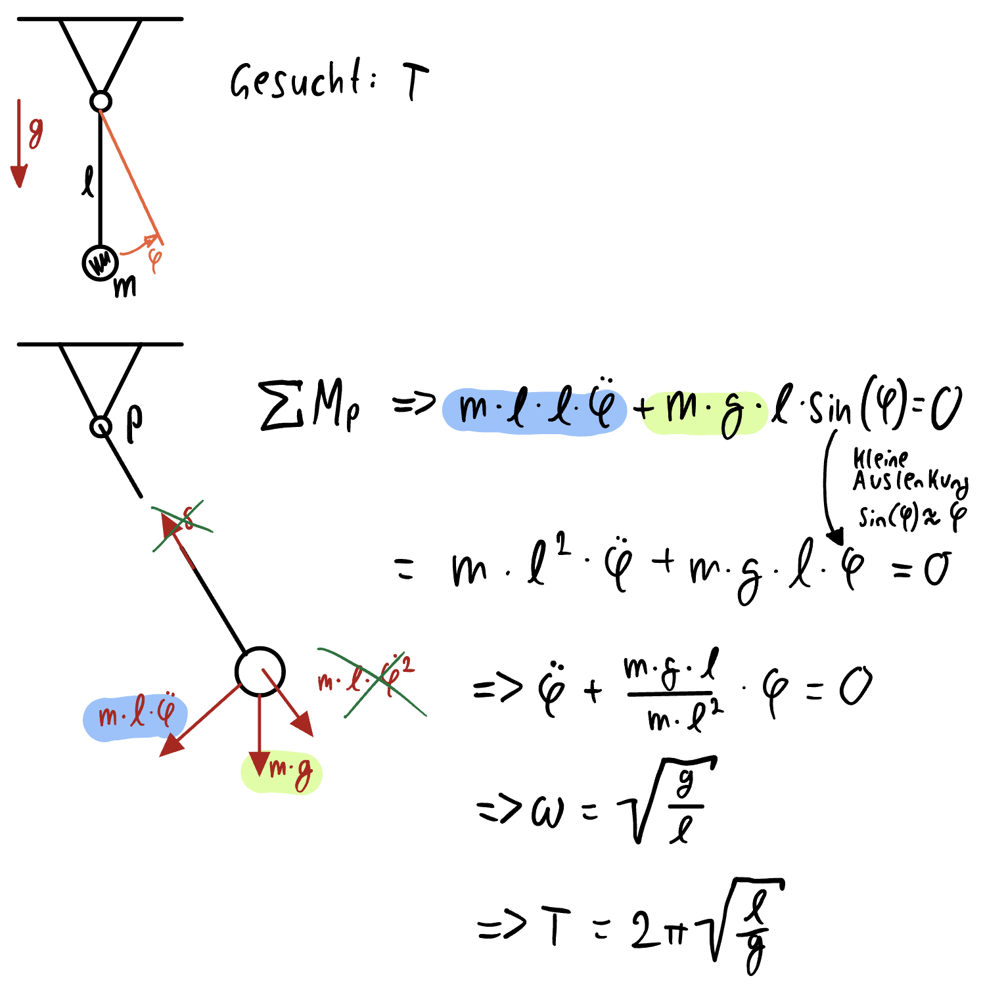
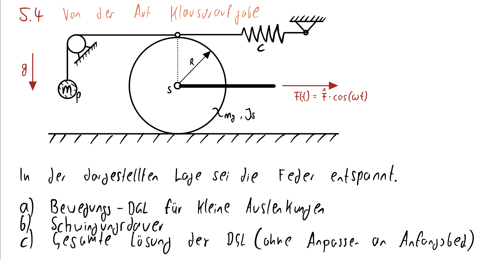
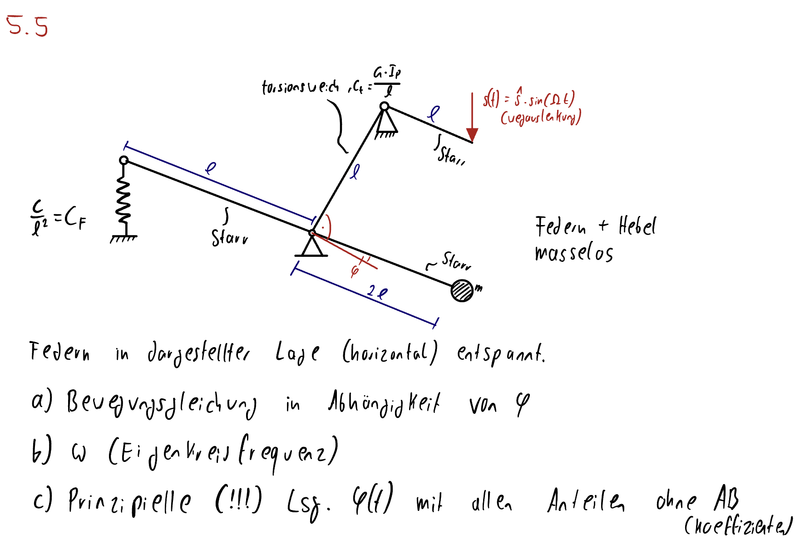

# 1. Einführung

## **1.1 Arbeitsgebiete der Maschinendynamik**

Die Maschinendynamik behandelt die Bewegungen und Beanspruchungen von Maschinen oder Maschinenteilen infolge zeitabhängiger mechanischer Belastungen. Oft sind das sich zeitlich periodisch wiederholende Vorgänge, manchmal auch zufällige Vorgänge. Bei letzterem ist nur eine statistische Beschreiibung möglich.

**=> Die zeitabhängigen Vorgänge werden als Schwingungen bezeichnet.**  
Diese können in fast allen Maschinen auftreten. Die Bewertung dieser Problemstellungen erfordert ein Grundverständnis der wesentlichen Phänomene, z.B. Eigenfrequenzen, Resonanzen, usw. sowie einen Überblick über Methoden der Modellierung, Bezeichnung und Simulation (analytisch und numerisch).  
Die Aufgaben der Maschinendynamik umfassen u.a. die Gestaltung von Maschinen in der Art, dass:

- unerwünscht Schwingungen klein bleiben
- erwünschte Schwingungen die geforderten Eigenschaften haben
- nicht vermeidbare Schwingungen nicht zu Schäden führen

Ferner umfassen die Aufgaben die Überwachung, Schadensfrüherkennung und Schadensdiagnose.

**Beispiele für erwünschte Schwingungen:**

- Siebanlage
- Rüttelförderer
- Rüttelplatte

Für den Entwickler ist es hilfreich, Maschinendynamische Untersuchungen möglichst früh im Enwicklungsprozess durchzuführen, da sich zu diesem Zeitpunkt das Schwingungsverhalten konstruktiv noch kostengünstig optimieren öässt.

Mit steigeneder Arbeitsgeschwindigkeit und höherer Materialausnutzung (Leichtbau) nimmt die Schwingungsanfälligkeit von Maschinen zu.

Moderne Maschinen besitzen oft Regelungen oder Steuerungen, die dafür sorgen, dass gewünschte Betriebszustände erreicht und aufrecht erhalten werden. Das Verhalten wird dabei in hohem Maße durch die nichtmechanischen Komponenten bestimmt, z.B. Industrieroboter, Verkehrsflugzeug, usw.

## **1.2 Ursachen für Schwingungen am Beispiel Kraftfahrzeug**

Die Ursachen für Schwingungen sind vielfältig, oft kann es schwer sein, überhaupt den Grund herauszufinden.

### **Antriebsstrang**

- Motor: Verbrennungsvorgänge
- Getriebe
- Antriebswellen (rotierende Teile)

### **Äußere Einflüsse**

- Kopfsteinpflaster, Bodenwellen, ...
- aufwendige Musikausstattung
- Füllstand z.B. im Tank
- Windeinflüsst, z.B. offenes Fenster
- aktive Fahrwerke
- dünnwandige Abdeckungen, Motorhauben
- Windkräfte, Seitenwind
- Beladungszustand, Anhänger
- ABS
- Unfall

## **1.3 Mechanische Schwingungen**

=> Schwingungen sind Vorgänge bei denen sich physikalische Größen zeitabhängig ändern.  
Jedes mechansiche System, dass eine stabile Gleichgewichtslage besitzt, ist ein schwingungsfähiges System. Die Gleichgewischtslage heißt stabil, wenn bei einer Störung des Gleichgewichts Kräfte geweckt werden, die das System in seine Gleichgewichtslage zurücktreiben.

Bei realen Systemen erfolgt der Austausch von potentieller und kinetischer Energie nicht verlustfrei. *=> z.B. Wärmeenergie, die dabei enststeht*.

Die Abnahme der Schwingungsenergie einer freien Schwingung (Energiedissipation) wird als Dämpfung bezeichnet, der umgekehrte Fall(Energie für Schwingungen wird zugeführt) als angefachte Schwingung.  
Die Stabile Gleichgewichtslage muss nicht unbedingt eine statische Ruhelage des Systems sein. Es kann sich auch um eine stationäre Bewegung mit einem ausgeglichenen Kräfte- bzw. Momentenhaushalt handeln.

## **1.4 Verfahren zur Lösung Maschinendynamischer Aufgaben**

>**Vorüberlegung:** Verfahren und damit einhergehender Aufwand in abhängigkeit von Problemstellung wählen, z.B.:
>
>- Vordimensionierung
>- Protoyp / Kleinserie
>- Serienbauteil

Früher wurden in der Regel Zeit- und Kostenaufwendige Prototypentests durchgeführt, die seit einiegen Jahren zunehmend von modernen Berechnungs- und Simulationsmethoden abgelöst wurden.

### **Rechnerische Verfahren (numerische / analytische Verfahren)**

|Vorteile|Nachteile|
| --- | --- |
|Schnell viele Varianten analysierbar|viele Annahmen zur Modellbildung, die mitunter zu Abweichungen zwischen Theorie und Praxis führen|
|günstiger und unabhägiger z.B. von experimentellen Ressourcen||
|kein reales Modell nötig||
|erweiterte Anlysemöglichkeiten, um z.B. Zusamenhänge erkennen zu können.||
|

Anwendung:

- Vorrausberechnung oder Optimierung
- Parameterstudien
- Auslegung und Sicherhetsnachweise
- Schadensdiagnose

### **Messtechnische Verfahren (reale Struktur, physikalische Modelle)**

|Vorteile|Nachteile|
|---|---|
|Alle wesentlichen Einflüsse können erfasst werden|Reale Struktur oder physikalisches Modell muss verfügbr sein|
|genaue Ergebnisse bis auf Messfehler|Parametereinflüsse oft schwierig erkennbar|
||nur direkt messbare Antwortgrößen erfassbar|
|

Anwendung:

- Schwingungsüberwachung
- Schadensfrüherkennung / -diagnose
- Verifikation rechnerischer Ergebnisse
- Feinabstimmung

### **Hybride Verfahren (Berechnung + Messung)**

Ziel ist die Eliminierung der spezifischen Nachteile von Berechnung (insbesondere Modellbildung) bzw. Messung (Messfehler).

Anwendung:

- Parameteridentifikation
- Schadensfrüherkennung / -diagnose
- Qualitätskontolle
- HIL-Anwendungen *(Hardware-in-the-loop)*

## **1.5 Grundsätzliche Vorgehensweisen ("Kochrezept")**

Allgemein:

1. Modellbildung z.B. auf Basis der Konstruktionsunterlagen
2. Lösung des Modells mithilfe verschiedener Methoden, z.B. ei einfachen Problemen per Hand, bei mittleren mittels MatLab und bei komplexeren (mit vielen freiheitsgraden) mittels FEM
3. Rückübersetzung und Interpretation der Ergebnisse (z.B. Kontrolle der Modellbildung/-ergebnisse, Korrektur des Modells)

Konkret:

1. Bewegungsgrößen und Koordinaten einführen
2. Positiv auslenken und freischneiden, alle Kräfte und Momente eintragen (auch z.B. Lagerreaktionen)
3. Gleichgewichtsbedingungen (vgl. TM-Statik)
4. Zusätzliche Gleichungen aufschreiben, z.B.:
   - kinematische Beziehungen
   - Reibgesetz $F_r = \mu *F_n$
   - Hook'sches Gesetz
5. Gleichungssystem lösen
6. Lösung deuten

Beispiel:

## **2. Modellbildung**

### **2.1 Grundbegriffe**

Zur Beschreibung von SChwingungen werden Ersatzsysteme (Modelle) verwendet, die vereinfachungen und Idealisierungen der Wirklichkeit enthalten. Die Modelle sollen alles wesentlichenEigenschaften der realen Struktur im Hinblick auf die untersuchte Fragestellung enthalten, d.h. ein System kann je nach Fragestellung durch unterschiedliche Ersatzsysteme beschrieben werden.

Beispiel: Sattelit

Modelle bestehen aus einzelnen, berechenbaren Elementen, die durch (System-)parameter (Abmessungen, Steifigkeit, Masse, ...) gekennzeichnet sind.

Der Zustand wird durch Zustandsgrößen (Geschwindigkeit, Druck, Verschiebung beschrieben. Durch Anwendung physikalischer Gesetzmäßigkeiten ergeben sich die Zusammenhänge, nach denen sich die Zustandsgrößen ändern.

### **2.2 Vorgehen bei der Modellierung**

### **2.3 Typen von Ersatzmodellen**

- kontinuierliche Ersatzmodelle => typischerweise FEM-Modelle  
  - Bspw. Fahrzeugkarosserie
- Nicht-parametrische Ersatzmodelle
  - =>Bescheibung auf Basis der Beziehung von Eingangs- und Ausgangsgrößen eines technischen Systems

- Diskrete Erstazmodelle
  - Die diskreten Ersatzmodelle der MD haben häufig die Form von gewöhnlichen Differentialgleichungen. Man erhält sie, wenn man die mechanischen Eigenschaften Masse, Nachiebigkeit und Dämpfung (gedanklich) trennt und durch
    - Starre, massenbehaftete Elemente (Massenpunkt, Starrkörper
    - nachgiebige, masselose Elemente (Federn)
    - energiezerstreuende Elemente (Dämpfer) idealisiert  
**=> Diskrete Modelle**

*Beispiel für ein Diskretes Modell*

### **2.4 Elemente diskreter Ersatzmodelle**

Feder

- Erzeugt eine rücktreibende Kraft und setzt einer Auslenkung einen Widerstand entgegen
- Träger einer potentiellen Energie
- Kraftgesetz typischerweise linear angenommen: $F_c = -c*x$
- Analog bei Drehbewegungen: $M = -C_\theta*\theta$

Feder als masselose Ersatzmodelle kontinuierlicher Systeme.

$$F_c = c*x$$

Weitere Beispiele:

- Balken mit Pinktlast, I, L, E => $\frac{3*E*I}{L^3}$
- Torsionsstab mit kreisförmigem Querschnitt, $I_p$, L, G => $C_p=\frac{G*I_p}{L}$

#### **Dämpfer**

- Hemmt Schwingungen und setzt Bewegung einen Widerstand entgegen
- Er wandelt Energie in Wäre um
- Verschiedene Kraftgesetze / Werkstoffmodelle

=> Die viskose Dämpfung tritt auf beim Gleiten auf geschmierten Kontaktflächen, Bewegungen in zäher Flüssigkeit bei laminarer Strömung oder bei viskoelastischem Materialverhalten.  
=> Coulomb'sche Reibung: $F_R = -\mu*F_N$

- Basiert auf Reubung in den Kontaktflächen
- Stärke ist unabhängig von der Geschwindigkeit
- wirkt entgegengesetzt zur Bewegungsrichtung

Nur bei Gleiten auf trockenen Kontaktflächen.

=> Luftwiderstands-Dämpfung $F=C_W*\frac{\rho}{2}*A*x^2$ mit $c_w$:Luftwiderstands-beiwert, $A$: Projektionsfläche

#### **Masse**

- Größe mit Trägheit, setzt der Beschleunigung eien Widerstand entgegen
- Träger kinetischer Energie
- Zusammenfassung aller relevanten Massen ein einem oder mehrere Punkten
- Bei Drehbewegungen Trägheitsmoment $J$

#### **Beispiele für einfache schwingende Systeme**

## 3. Beschreibung von Schwingungen

Der Begriff Schwingungen ist nicht allgemein gebräuchlich , streng definiert. Es werden sowohl periodische Schwingungen eines Pendels als auch Schwingungen des Bodens bei einem Erdbeben als Schwingung bezeichnet.  
Einteilung nach dem zeitlichen Verlauf nach DIN1311

|Schwingungsart|Beschreibung|
|---|---|
|Stochastische Schwingungen|Zufällig, regellos|
|Deterministische Schwingungen|eindeutig beschreibbar|
|Periodische Schwingungen|sich regelmäßig wiederholend|
|Harmonische Schwingungen|durch sin, cos, etc. beschreibbar|
|Modulierte Schwingungen|überlagerte harmonische Schwingungen|

=> Schwingungen sind damit mehr oder weniger zeitbhängige Vorgänge, die durch eine Zustandsgröße, z.B. $x = x(t), \phi = \phi(t)$ beschreibbar sind.  

Periodische Schwingung: $x(t+T) = (t)$ mit $T$: Schwingungsdauer / Periode  
Frequenz: $f=\frac{1}{T}$  

**Unterscheidung nach Art der Bewegungsgleichung:**

|Linear|Nicht-Linear|
|---|---|
|-> Von $x$/$\dot{x}$ abhängige Terme linear|-> Gleichungen komplex, oft nur numerisch lösbar|
|-> Gleichungen analytisch lösbar||

**Unterscheidung nach Zahl der Schwinger**

- 1 Freiheitsgrad -> z.B. Feder, Pendel => durch DGL beschreibbar
- $n$ FG -> z.B. gekoppelte Schwinger => durch mehrere DGL beschreibbar
- kontinuierliche Schwinger -> z.B. Balkenn Platten, Saite => "unendlich viele FG, sind durch partielle DGL beschreibbar"

**Unterscheidung nach Entstehungsmechanismus**

- Autonom, d.h. aus dem Schwinger selbst, z.B. Eigenschwingung, selbsterregte Schwingung (ggf. mit äußerer Energiezufuhr)
- Heteronom, d.h. von außen bestimmt
  - erzwungen, d.h. durch direkte äußere Einwirkung, z.B. Kraft, Weg...
  - parametererregte Schwingung, d.h. durch Änderung von Systemparametern, z.B. Schaukel, bei der die Pendellänge geändert wird.

## 4. Bewegungsgleichungen für Schwingungen

**=>Siehe Kochrezept!**  

*Beispielaufgabe 1: Einfacher Schwinger*

Weiteres Beispiel:

*Beispielaufgabe 2: WTF???*

Hinweise/Anmerkungen:

1. Nullpunkte der Koordinaten
   - typ. so wähle, dass sie im GG=0 sind
   - statische Kräfte (z.B. Masse und zugehörge Ruheausdehnung einer Feder) heben sich auf
   - Müssen in DGL nicht berüchsichtigt werden
   - genauere Betrachtung bei nicht-linearen Federn notwendig
2. Bestimme der Kräfte
   - i.d.R. nur Näherungsweise für kleine Auslenkungen
   - Vorzeichen aus "positiver Auslenkung" der Koordinate / des Systems (Kraft in gleicher Richtung positiv, in entgegengesetzter Richtung negativ)
3. Standartform
   - DGL mit möglichst wenig / einfachen Parametern
   - i.d.R. Vorfaktor "1" mit Trägheitsterm
   - "rechte" Seite - äußere Einflüsse, "linke" - inneres Systemverhalten

... zurück zum Anfangsbeispiel:

DGL:
$$m\ddot{x}+cx = 0$$

Lösung:
$$\ddot{x}=-\frac{c}{m}x$$

=> Gesucht ist eine Funktion $x=x(t)$, bei der sich die 2. Ableitung nur durch einen Konstanten Faktor ($-\frac{c}{m}$) von der Funktion selbst unterscheidet.

=> Lösungsansatz: cos- / sin-Funktionen

Ansatz:

$$x(t) = a*cos(\omega t)+b*sin(\omega t)$$
Ableiten:
$$\dot{x}(t) = - a*\omega *sin(\omega t) + b * \omega *cos( \omega t)$$
$$\ddot x(t) = -a * \omega^2 * cos(\omega t) - b * \omega ^2 * sin( \omega t)$$
$$= (-\omega ^2)*(a*cos( \omega t) +b*sin( \omega t))$$

Einsetzen in DGL:
$$m\ddot{x}+cx = 0$$

Man sieht: Wenn $(a,b)\not ={0}$ wird der linke Term nicht null, da sin und cos Phasenversetzt sind. Also muss gelten:
$$-\omega ^2 *m + c \overset{!}{=} 0$$

$\omega$ ist die Eigenkreisfrequenz des ungedämpften 1-Massen-Schwingers.  
Allgemein gilt: $\omega = \sqrt{\frac{Steifigkeit}{Masse}}$  
Bestimmung der Koeffizienten a,  durch Anpassen der Anfangsbedingungen

z.B. $\dot{x}(t)=0=\dot{x_0}=v_0$  
$x(t=0)=x_0$  
=> $x(t=0)=a*cos(0)+b*sin(0)$  
$\dot{x}(t=0)=-a\omega*sin(0)b*\omega *cos(0)=b*\omega=v_0$  
=> $b=\frac{v_0}{\omega}$

Lösung: $x(t)=x_0*cos(\omega t)+\frac{v_0}{\omega}*sin(\omega t)$ mit $\omega=\frac{\sqrt{c}}{m}$

Beispiel:

$\omega$ ist das, was vor dem Phi steht.

### Erzwungene, ungedämpfte Schwingungen mit einem Freiheitsgrad

Feder-Masse-Schwinger mit Gewicht:

Lösung: lineare DGL 2. Ordnung inhomogen:
$$m*\ddot{x}+c*x=m*g$$
Links vom $=$ stehen "interne Einflüsse", rechts stehen "externe Einflüsse"
$$\ddot{x}+\frac{c}{m}*x=g$$
Lösung der DGL durch Überlagern:
$$x(t)=x_h(t)+x_p(t)$$
mit $x_h(t)$: Lsg der homogenen DGL  
$x_p(t) = a*cos(\omega t) + b*sin(\omega t)$ und $\omega = \sqrt{\frac{c}{m}}$ 

Einsetzen von 
$x(t) = x_h(t)+x_p(t)$  
$\ddot{x}_h(t)+\ddot{x}_p(t)$  
in DGL =>  
$m*\ddot{x}_p(t)+c*x_p(t)=m*g$ weil $m*\ddot{x}_h+c*c_h=0$

Für die partikuläre Lösung kann z.B. ein Ansatz vom Typ der rechten Seite gewählt werden:  
$x_p(t)=x_{stat} = konst$, da die "rechte Seite" ebenfalls konstant ist.  
Ansatz ableiten und einsetzen: $\ddot{x}_p(t)=0$  
=> $C*x_{stat}=m*g$  
$\iff x_{stat}=\frac{m*g}{C}$ (*statische Auslenkung des Systems*)

Allgemeine Lösung: $x(t)=a*cos)\omega t)+b*sin(\omega t)+x_{stat}$  
Die allgemeine Lösung einer linearen homogenen DGL setzt sich aus einem Pratikular-Integral (=Lösung) der vollständigen (inhomogenen) Gleichung und der allg. Lösung der homogenen Gleichung zusammen.

Anpassen an Anfangsbedingungen:
$$x(t=0)=x_0 \rightarrow x_0 = a+x_{stat} \rightarrow a=x_0-\frac{m*g}{c}$$
$$\dot{x}(t=0)=v_0=\dot{x}_0 \rightarrow \dot{x}_0=b*\omega \rightarrow b=\frac{\dot{x}_0}{\omega}$$

Damit lautet die vollständige Lösung:
$$x(t)=(x_0-\frac{m*g}{c})*cos(\omega t)+\frac{\dot{x}_0}{\omega}*sin(\omega t)+\frac{m*g}{c}$$

### Schwinger mit periodischer Kraftanregung

Lösung der DGL durh überlagern: $x(t)=x_h(t)+x_p(t)$ mit  
$x_h(t)=a*cos(\omega t)+ b*sin(\omega t)$ *(homogene Lsg.)*

...ableiten und einsetzen...
$$\ddot{x}(t)=\ddot{x}_h(t)+\ddot{x}_p(t)$$
$$\rightarrow m*\ddot{x}_p+C_{xp}= \^{F}*cos(\Omega t)$$
den $m*\ddot{x}_h+c*x_h=0$

Ansatz vom Typ der rechten Seite (hier "Gleichtaktansatz")

$$x_p(t)=\^{x}_p*cos(\Omega t)$$

d.h. es wird angenomen, dass die Masse m der äußeren Kraft $F(t)$ (im wesentlichen) folgt. Die Frage ist allerdings, mit welcher Auslenkung?  
Ansatz ableiten und einsetzen:

$$x_p(t)=\^{x}_p*cos(\Omega t)$$
$$\dot{x}_p(t)=-\^{x}*sin(\Omega t) * \Omega$$
$$\ddot{x}_p(t)=-\^{x}_p*cos(\Omega t)*\Omega ^2$$
$$\rightarrow -\Omega ^2*m*\^{x}_p*cos(\Omega t)+(\^{x}_p - \^{F}) = 0$$
$$\iff cos(\Omega t)[(-m*\Omega ^2+c)*\^{x}_p-\^{F}] = 0$$
$$\rightarrow (-m*\Omega ^2+c)\^{x}_p=\^{F}$$
$$\iff \^{x}_p=\frac{\^{F}}{-m*\omega^2+c}=\frac{\^{F}}{C}*\frac{1}{1-\frac{m}{c}*\Omega}$$
$$= \frac{\^{F}}{C}*\frac{1}{1-\frac{\Omega ^2}{\omega ^2}}$$
mit $\eta=\frac{\Omega}{\omega}$ und $\omega=\sqrt{\frac{c}{m}}$
$$\^{x}_p=\frac{\^{F}}{C}*\frac{1}{1-\eta ^2}$$

Hinweis: Gilt $\Omega \thickapprox \omega$, d.h. Eingenkreisfrequenz ungefähr gleich Erregerkreisfrequenz, folgt:  
$$\^{x}_p \rightarrow \infin$$
also "Zerstörung". $\Omega=\omega$ bezeichnet man als Resonanzfall.
∏
Gesamt Lösung:
$$x(t)=a*cos(\omega t) + b*sin(\omega t)+\^{x}_p*cos(\Omega t)$$
Anpassen an Anfangsbedingungen
$$x(t=0)=x_0 \rightarrow x_0=a+\^{x}_p \rightarrow a=x_0-\^{x}_p$$
$$\dot{x}(t=0)=v_0=\dot{x}_0=-a-\omega *sin(0)+b*\omega*cos(0)-\^{x}_p*\Omega * 0$$
$$\Rightarrow b=\frac{\dot{X}_0}{\omega}$$
$$x(t)=(x_0-\^{x}_p)*cos(\omega t)+\frac{\dot{x}_o}{\omega}*sin(\omega t)+\^{x}_p*cos(\Omega t)$$

## Übungsaufgaben

### Aufgabe 4.1

Eine Masse $m$ hängt an einer an der Decke befestigten Feder. Sie schwingt unter ihrem Eigengewicht.

### Aufgabe 5.1

Der Schwinger vollführt kleine Schwingungen um die horizontale Ruhelage (Drehschwingung um A).

### Aufgabe 5.2

### Aufgabe 5.3

### Aufgabe 5.4

### Aufgabe 5.5

### Aufgabe 5.6

